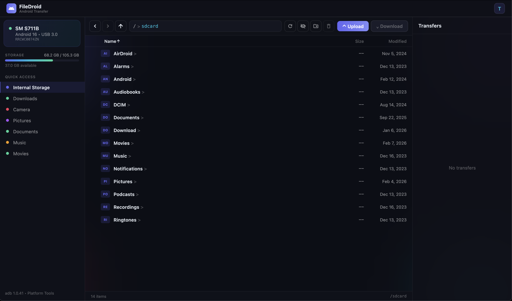
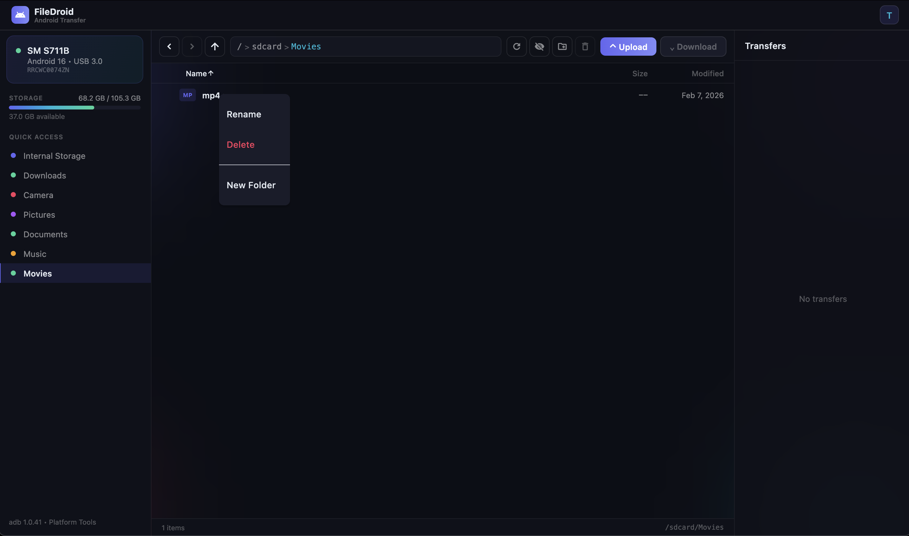
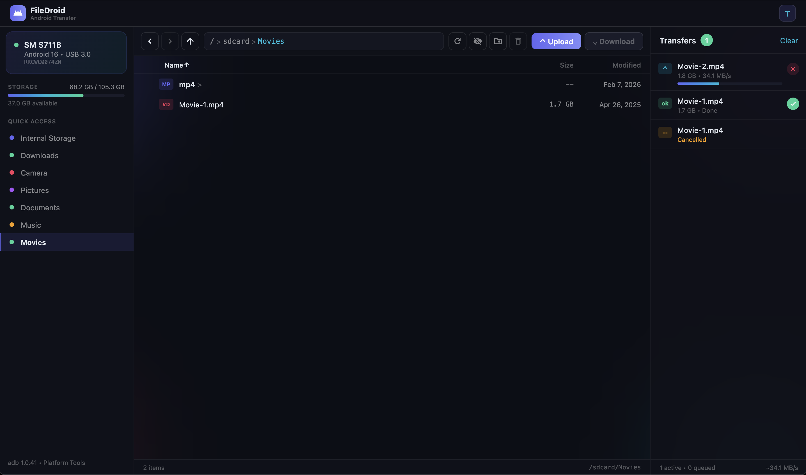

<p align="center">
  
</p>

<h1 align="center">FileDroid</h1>

<p align="center">
  <strong>The Android file transfer app that macOS deserves.</strong><br>
  Fast, native, and beautiful — because Google killed theirs.
</p>

<p align="center">
  <a href="https://github.com/andrisasuke/filedroid/releases/latest"></a>
  
  
  
  
  
  
  
</p>

---

Google discontinued Android File Transfer for macOS. The alternatives are either slow, ugly, or cost money.

**FileDroid** is a free, open-source replacement built with Flutter. It connects to your Android device over USB via ADB and gives you a full file browser with drag-and-drop, real-time transfer progress, and a dark UI that actually looks good on your Mac.

## Features

- **Browse files** — Navigate your Android filesystem with breadcrumb navigation, back/forward history, and sortable columns (name, size, date, type)
- **Upload & Download** — Transfer files between Mac and Android with real-time progress, speed indicators, and transfer queue
- **Drag & Drop** — Drop files directly from Finder into any folder on your device
- **File management** — Create folders, rename files/folders, delete with confirmation — all via right-click context menu or toolbar
- **Quick Access sidebar** — Jump to Internal Storage, Downloads, Camera, Pictures, Documents, Music, or Movies in one click
- **Device info** — See device model, Android version, USB mode, and storage usage at a glance
- **Multi-file selection** — Select multiple files with checkboxes, batch download or delete
- **Hidden files toggle** — Show/hide dotfiles with one click
- **Cancel transfers** — Cancel in-progress or queued transfers anytime
- **Auto-detect ADB** — Finds ADB from Homebrew, Android Studio, or custom paths — with a guided setup if it's missing
- **Native macOS app** — Proper window chrome, title bar integration, and macOS-native feel

## Screenshots

| File Browser | Context Menu | Transfers |
|:---:|:---:|:---:|
|  |  |  |

## Download

Grab the latest release from the [**Releases page**](https://github.com/andrisasuke/filedroid/releases/latest):

| File | Mac |
|---|---|
| `FileDroid-x.x.x-macOS-arm64.dmg` | Apple Silicon (M1/M2/M3/M4) |
| `FileDroid-x.x.x-macOS-x86_64.dmg` | Intel |

> **macOS Gatekeeper:** Since the app is not code-signed, macOS will block it on first launch. After dragging to Applications, run:
> ```bash
> xattr -cr /Applications/FileDroid.app
> ```
> Or right-click the app → **Open** → click **Open** again.

## Getting Started

### Prerequisites

- **macOS** 12.0 or later
- **ADB** (Android Debug Bridge) — install via one of:
  ```bash
  # Homebrew (recommended)
  brew install android-platform-tools

  # Or install Android Studio — ADB is included
  ```
- **USB Debugging** enabled on your Android device
  > Settings > Developer Options > USB Debugging

### Install from Source

```bash
# Clone the repo
git clone https://github.com/andrisasuke/filedroid.git
cd filedroid

# Install dependencies
flutter pub get

# Build the macOS app
flutter build macos

# The app is at: build/macos/Build/Products/Release/FileDroid.app
```

### Run in Development

```bash
flutter run -d macos
```

## How It Works

FileDroid communicates with your Android device through **ADB** (Android Debug Bridge) over USB. No network connection, no cloud, no accounts — just a direct cable connection.

1. Plug in your Android device via USB
2. Accept the "Allow USB debugging" prompt on your phone
3. FileDroid auto-detects the device and shows your files

All file operations (`ls`, `push`, `pull`, `mkdir`, `mv`, `rm`) are executed through ADB shell commands.

## Tech Stack

| Component | Technology |
|---|---|
| Framework | Flutter 3.38 |
| Platform | macOS (desktop) |
| UI Kit | macos_ui |
| State | Provider |
| Device Bridge | ADB via dart:io Process |
| Drag & Drop | desktop_drop |
| File Picker | file_picker |

## Project Structure

```
lib/
  main.dart                  # App entry point & provider setup
  models/
    android_device.dart      # Device model (id, model, status)
    android_file.dart        # File model (name, path, size, type badges)
    transfer_task.dart       # Transfer task model (progress, status)
  providers/
    device_provider.dart     # Device detection & polling
    file_browser_provider.dart  # File listing, navigation, selection
    transfer_provider.dart   # Upload/download queue & progress
  services/
    adb_service.dart         # All ADB commands (ls, push, pull, mkdir, mv, rm)
  screens/
    home_screen.dart         # Main layout & window chrome
  widgets/
    file_browser.dart        # File list, context menus, drag-drop zone
    browser_toolbar.dart     # Navigation, search, action buttons
    device_panel.dart        # Sidebar: device info, storage, quick access
    transfer_panel.dart      # Transfer queue & progress
    adb_setup_screen.dart    # ADB not found — guided setup
  utils/
    theme.dart               # Dark theme, gradients, colors
```

## Contributing

Contributions are welcome! Feel free to open issues or submit pull requests.

```bash
# Run analysis before submitting
flutter analyze
```

## Disclaimer

This is a **personal hobby project** built for fun and learning. It is not intended for commercial distribution or production use. Use at your own risk.

## License

This project is licensed under the **GNU General Public License v3.0 (GPL-3.0)** — see [LICENSE](LICENSE) for details.

You are free to use, modify, and share this software for **non-commercial purposes**. Any derivative work must also be open-sourced under the same license.

---

<p align="center">
  <sub>Built because Google killed Android File Transfer and left us with nothing.</sub>
</p>
